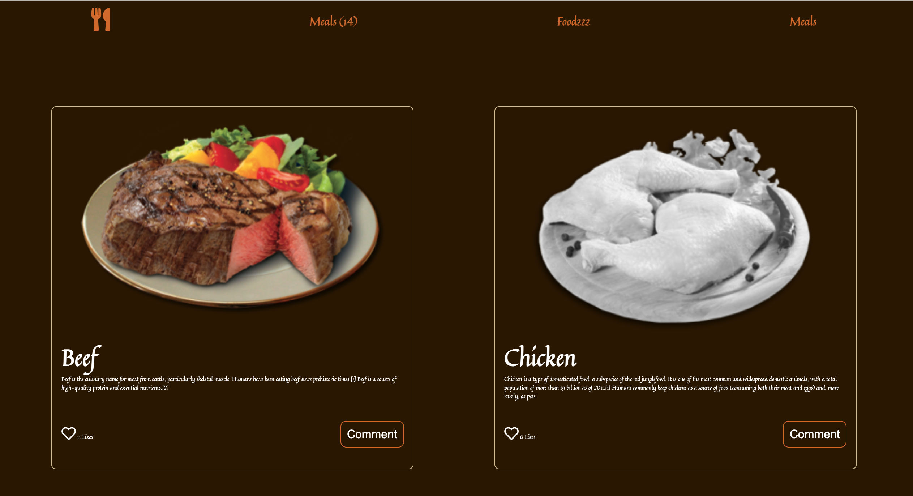

# The Capstone Project JS 


> This Webapp displays a list of food dishes. The user is able to like any of the meals, and also read more information about each meal once he clicks on the **Comment** button. Also, the user is able to leave a comment about any meal.


## Built With

- HTML
- CSS
- JavaScript
- Webpack

## Live Demo 

[Live Demo Link](https://foodzz.netlify.app/)

## Video Demo
[Video Demo Link](https://drive.google.com/file/d/10qujYBtnvg8TrbZGNyQeQfmVIIHOylPK/view?usp=sharing)


## Getting Started


To get a local copy up and running follow these simple example steps.


- clone the repository by running
``` git clone https://github.com/selma-belhadj/JSCapstone.git ```
- navigate to the folder
``` cd JSCapstone ```
- Install packages
``` npm install ```
- Run the app
``` npm start ```
## Prerequisites
- Linters
- GitHub Flow
- Javascript
- WEBPACK
- Jest
### Run tests
Run the test 
`npm run test`


## Authors

👤 **Author 1: Omar Salem**

- GitHub: [Omar Salem](https://github.com/omarsalem7)
- Twitter: [Omar Salem](https://twitter.com/Omar80491499)
- LinkedIn: [Omar Salem](https://www.linkedin.com/in/omar-salem-a6945b177/)

👤 **Author 2: Selma Belhadj**

- GitHub: [@selma-belhadj](https://github.com/selma-belhadj)
- Twitter: [@Bel_Selma16](https://twitter.com/Bel_Selma16)
- LinkedIn: [@selma-belhadj](https://www.linkedin.com/in/selma-belhadj/)

## Show your support

Give a ⭐️ if you like this project!

